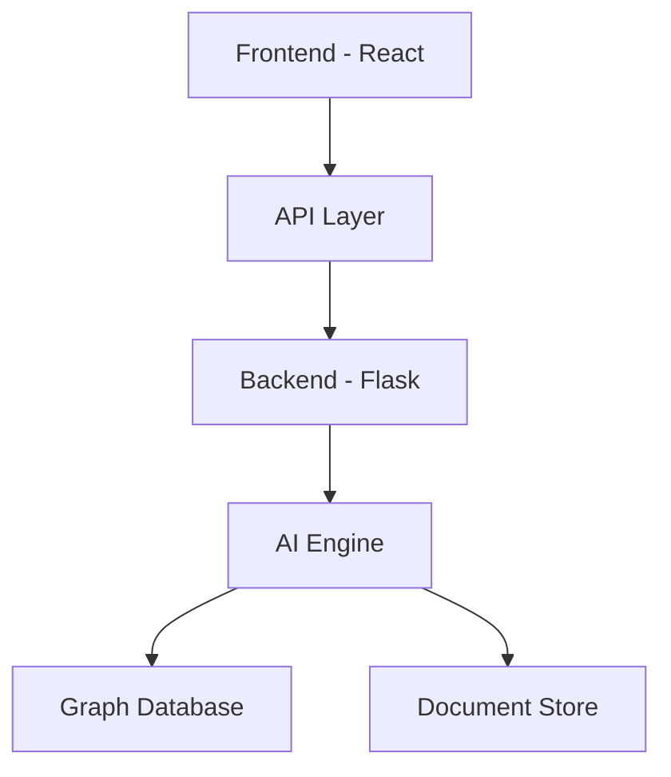

<div align="center">
  
# REAIA 🧠
### Your AI-Powered Research Assistant

[](https://reactjs.org/)
[](https://flask.palletsprojects.com/)
[](https://www.python.org/)
[](https://opensource.org/licenses/MIT)


</div>

## 🌟 Features

### 📊 Interactive Graph Visualization
Explore research papers and their connections through our intuitive graph visualization interface.
- Dynamic force-directed graphs
- Paper relationship mapping
- Visual citation networks
- Interactive node exploration

### 💬 Smart Document Chat
Engage with research papers through our advanced chat interface:
- Context-aware conversations
- Deep document understanding
- Multi-document queries
- Citation extraction

### 📈 Self-Evaluation Tools
Evaluate research relevance with powerful analytics:
- Relevance scoring
- Readability analysis
- Uniqueness detection
- Impact assessment

<div align="center">

</div>

## 🚀 Getting Started

### Prerequisites
```bash
# Clone the repository
git clone https://github.com/yourusername/reaia.git

# Navigate to the project directory
cd reaia
```

### Frontend Setup
```bash
# Navigate to frontend directory
cd frontend

# Install dependencies
npm install

# Start development server
npm start
```

### Backend Setup
```bash
# Navigate to backend directory
cd backend

# Create virtual environment
python -m venv venv

# Activate virtual environment
source venv/bin/activate  # Linux/Mac
venv\Scripts\activate     # Windows

# Install dependencies
pip install -r requirements.txt

# Start Flask server
python app.py
```

## 🎯 Usage Example

```python
from reaia import ResearchAssistant

# Initialize REAIA
assistant = ResearchAssistant()

# Search for relevant papers
papers = assistant.search("artificial intelligence in healthcare")

# Generate insights
insights = assistant.analyze(papers)
```

<div align="center">

</div>

## 🏗️ Architecture



## 💡 Key Components

- **Frontend**: React.js with Tailwincd CSS
- **Backend**: Flask RESTful API
- **Models Used**: 
- **Database**: 


## 👥 Team

- Project Lead: [Mainul](https://github.com/yourusername)
- Frontend Developer: [Achuth Dintakurthi](https://github.com/developer1)
- Backend Developer: [Aadarsh](https://github.com/developer2)
- Backend Developer: [Yogesh Kumar](https://github.com/developer2)

## 📞 Contact

For support or queries:
- Email: 
- Twitter: 
- Website: 

<div align="center">

---

Made with ❤️ by the REAIA Team

[⬆ Back to top](#reaia-)

</div>
